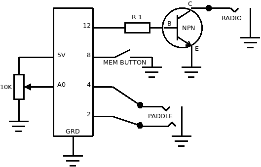

# **K3GDS Keyer**

The K3GDS Keyer is a morse code keyer for Arduino.  The project is simple enough that any amateur radio operator should be able to build one, even without previous Arudino experience. 

### Memory

To start recording, hold down the memory button for at least 1 second.  When you release the button, an LED will turn on to indicate that recording is active.  The keyer will not record any leading or trailing silence.  Tap the button (for less than 1 second) to stop recording and tap it again to play back the saved message.

The memory can hold about 90 seconds at 20wpm.

### Speed Potentiometer

The potentiometer is configured for a speed range from about 15wpm to about 30wpm.  This is handled by the function `event_length_ms`.  If you want to experiment with other values, start by changing `40` to a lower (for higher speeds) or higher (for lower speeds) value.

### Building Your Own

##### Materials

	- An Arduino Uno (or similar) microcontroller
	- An NPN transistor
	- A resistor (R1) for the transistor base
	- A 10K ohm potentiometer
	- Two 1/4" or 3.5mm jacks for the key in and key out
	- A normally closed momentary switch (button) for the memory control
	- (Optional) An LED and 220 ohm resistor

##### Notes

- I use a PN2222 NPN transistor with a 50K ohm resistor.  The ideal resistor value for this transistor should be 86K ohms based on measurements taken with two of my radios.
- One jack should be stereo (input), the other can be mono (output).
- If you don't use the built-in LED, the pin value to change is `MEMORY_LED_PIN`.
- If you use a normally open button for memory, you will need to invert `digitalRead(MEMORY_BUTTON_PIN)` in `loop`.
