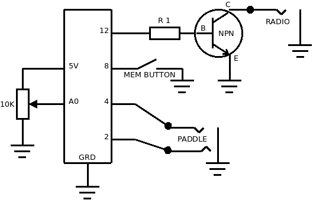

### K3GDS Keyer

The K3GDS Keyer is a morse code keyer designed for the Arduino platform.  The project is simple enough that any amateur radio operator should feel confident of his ability to finish his project, even without previous experience using Arduino (or similar) microcontrollers. 

### Building Your Own

###### Materials:

	- An Arduino Uno (or similar) microcontroller
	- An NPN transistor
	- A resistor (R1) for the transistor base
	- A 10K ohm potentiometer
	- Two 1/4" or 3.5mm jacks for the key in and key out
	- A normally closed momentary switch (button) for the memory control
	- (Optional) An LED and 220 ohm resistor

###### The transistor and resistor values

Any small NPN transistor should work fine.  On my prototype, I'm using a PN2222 NPN transistor with a 50K ohm resistor.  Based on measurements taken with two of my radios, I've determined a target resistor value to actually be around 86K ohms.  This is a rather low-current application, so it takes very little into the base to sufficiently saturate the transistor.  

_Note: This whole thing probably isn't a great idea with old tube radios.  Some of those things can put a good bit of juice across the key._  

###### The LED pin

If you don't use the built in LED, the pin value to be changed is `MEMORY_LED_PIN`.

###### The button

There are two lines that state `memory_button_state = digitalRead(MEMORY_BUTTON_PIN);`.  I use a "normally closed" switch in my prototype.  If you use a normally open switch, you should change both of these to `memory_button_state = !digitalRead(MEMORY_BUTTON_PIN);`.

### Current Features

###### Speed Potentiometer

The lowest and highest possible speeds are set in the program's `set_lengths` function: `unit_length_ms = 40 + (analogRead(SPEED_POT) / 25);`.  This will give a range of values from 40-80 milliseconds, corresponding to a dit at 15-30wpm. 

If you want to experiment with other values, start with changing `40` to a lower (for higher speeds) or higher (for lower speeds) value.  If you want to do math, you can convert a speed in wpm to ms-per-dit with `ms-per-dit = 6000 / (5 * wpm)`.  This uses 'PARIS' as the standard for speed calculation.  

###### Memory Keyer

This is accessed by holding down the memory button for at least 1 second.  The LED will turn on, indicating that the memory is recording.  The memory will not record any leading or trailing silence.  It uses your pacing to determine if you are trying to space characters or words, so it does help to be precise.  You can stop recording by tapping the button, and you can play back the message by tapping the button (for less than 1 second).  The maximum memory length is certainly more than you should ever need (about 90 seconds at 20wpm).

### And...

If you read this far and go on to build this thing, please email pictures and comments to the address on my QRZ page.  Thanks!
